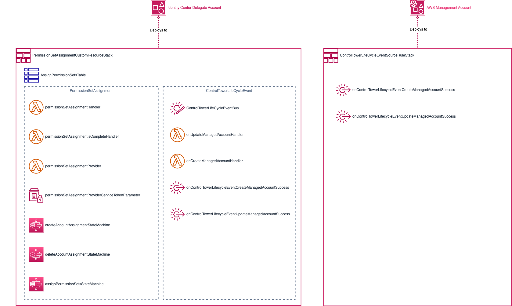
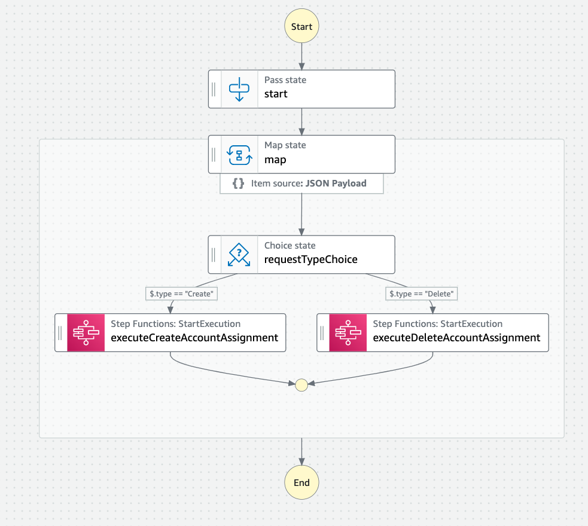
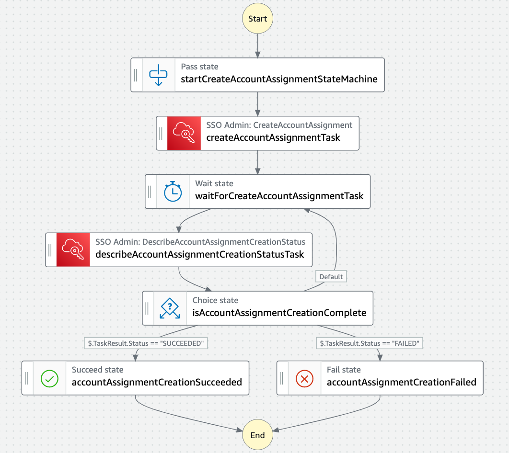
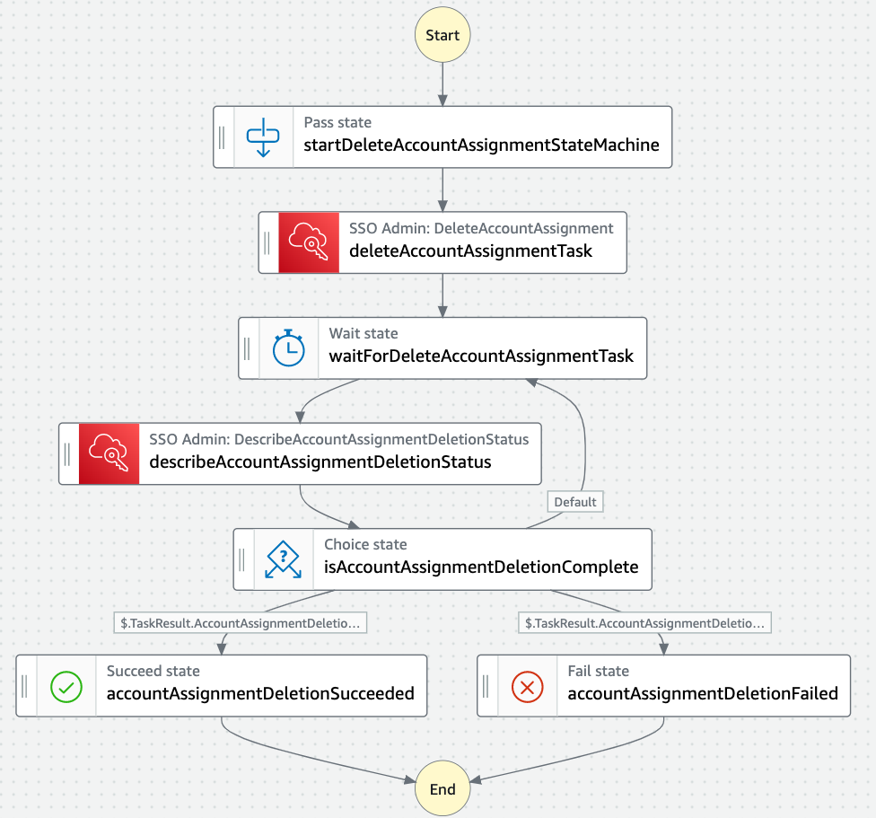
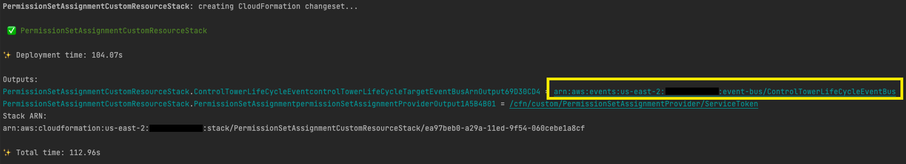

# aws-permission-set-assignment-custom-resource

## Overview
[AWS IAM Identity Center](https://docs.aws.amazon.com/singlesignon/latest/userguide/what-is.html) provides a way for organizations to centrally manage the administration of users and their access to AWS accounts via the AWS Console. 
However, large enterprises, with many accounts, need a solution for automatically associating groups of users with specific permission sets to accounts in a given organizational units. This CDK project provides an **example** solution of how customers can automate the association of [permission sets](https://docs.aws.amazon.com/singlesignon/latest/userguide/permissionsetsconcept.html)
with AWS users and groups to accounts and [organizational units (OUs)](https://docs.aws.amazon.com/organizations/latest/userguide/orgs_manage_ous.html) within an [AWS organization](https://docs.aws.amazon.com/organizations/latest/userguide/orgs_introduction.html) using [CloudFormation custom resources](https://docs.aws.amazon.com/AWSCloudFormation/latest/UserGuide/template-custom-resources.html).

## Prerequisites

* Install [NodeJS](https://nodejs.org/en/download/)
* [AWS Organization](https://docs.aws.amazon.com/organizations/latest/userguide/orgs_introduction.html)
* [AWS Control Tower](https://docs.aws.amazon.com/controltower/latest/userguide/what-is-control-tower.html)
* [AWS IAM Identity Center](https://docs.aws.amazon.com/singlesignon/latest/userguide/what-is.html)
  * An AWS IAM Identity Center [delegated administration account](https://docs.aws.amazon.com/singlesignon/latest/userguide/delegated-admin.html)

## Architecture
The CDK application consists of two CloudFormation stacks; [PermissionSetAssignmentCustomResourceStack](./src/infrastructure.ts#L360) and [ControlTowerLifeCycleEventSourceRuleStack](./src/infrastructure.ts#L391).



### PermissionSetAssignmentCustomResourceStack
This stack is designed to be deployed in the AWS IAM Identity Center [delegated administration account](https://docs.aws.amazon.com/singlesignon/latest/userguide/delegated-admin.html). It deploys infrastructure and resources that are used to manage permission set associations between users/groups and AWS accounts.
The stack consists of the following components

* **AssignPermissionSetsTable** - An AWS DynamoDB table that stores information on the completion status of [AWS Step Functions state machines](https://docs.aws.amazon.com/step-functions/latest/dg/welcome.html) along with accounts and organizational unit associations with [permission-set-assignment](./permission-set-assignment.yaml) CloudFormation stacks.
* **PermissionSetAssignment** - A custom CDK construct whose components handle the creation, update, and deletion of permission set associations to users and group for AWS accounts as specified in [permission-set-assignment](./permission-set-assignment.yaml) CloudFormation stacks
  * [permissionSetAssignmentHandler](./src/permissionSetAssignmentHandler.ts) - A lambda function that processes a [CdkCustomResourceEvent](https://docs.aws.amazon.com/cdk/api/v2/docs/aws-cdk-lib.custom_resources-readme.html), transforms the input from a [permission-set-assignment](./permission-set-assignment.yaml) stack into [AccountAssignmentCommandInput](./src/model.ts#L37) objects, records the targets in the AssignPermissionSetsTable,  and then submits that input to the [assignPermissionSetsStateMachine](./src/infrastructure.ts#L337) for processing.
  * [permissionSetAssignmentIsCompleteHandler](./src/isCompleteHandler.ts) - A lambda function that provides asynchronous status information to CloudFormation.
  * [permissionSetAssignmentProvider](./src/infrastructure.ts#L95) - The AWS CloudFormation [custom resource provider](https://docs.aws.amazon.com/cdk/api/v2/docs/aws-cdk-lib.custom_resources-readme.html#provider-framework)
  * [assignPermissionSetsStateMachine](./src/infrastructure.ts#L337) - AWS Step Function [standard](https://docs.aws.amazon.com/step-functions/latest/dg/concepts-standard-vs-express.html) state machine that maps [AccountAssignmentCommandInput](./src/model.ts#L37) to create/delete state machine inputs.
       
    * [createAccountAssignmentStateMachine](./src/infrastructure.ts#L195) - AWS Step Functions [express](https://docs.aws.amazon.com/step-functions/latest/dg/cost-opt-exp-workflows.html) state machine for creating permission set associations
      
    * [deleteAccountAssignmentStateMachine](./src/infrastructure.ts#L116) - AWS Step Functions [express](https://docs.aws.amazon.com/step-functions/latest/dg/cost-opt-exp-workflows.html) state machine for deleting permission set associations
      
* **ControlTowerLifeCycleEvent** - A custom CDK construct whose components handle [Control Tower lifecycle events](https://docs.aws.amazon.com/controltower/latest/userguide/lifecycle-events.html), [UpdateManagedAccount](https://docs.aws.amazon.com/controltower/latest/userguide/lifecycle-events.html#update-managed-account) and [CreateManagedAccount](https://docs.aws.amazon.com/controltower/latest/userguide/lifecycle-events.html#create-managed-account), that are forwarded from the AWS Organization management account.
  * [onControlTowerLifeCycleEvent](./src/controlTowerLifeCycleEventHandler.ts#L44) - Retrieves the associations at the root, ou, and account level for the account that generated the event and runs applicable [permission-set-assignment](./permission-set-assignment.yaml) stacks. 
    * [onUpdateManagedAccountHandler](./src/controlTowerLifeCycleEventHandler.ts#L11) 
    * [onCreateManagedAccount](./src/controlTowerLifeCycleEventHandler.ts#L28)
  * [ControlTowerLifeCycleEventBus](./src/infrastructure.ts#L394) - An [Amazon EventBridge eventbus](https://docs.aws.amazon.com/eventbridge/latest/userguide/eb-event-bus.html) the receives Control Tower LifeCycle Events, UpdateManagement and CreateManagedAccount, forwarded from the AWS Organization management account.
    * [onControlTowerLifecycleEventCreateManagedAccountSuccess](./src/infrastructure.ts#L453) - Handles CreateManagedAccount events and trigger [permission-set-assignment](./permission-set-assignment.yaml) CloudFormation stacks that would apply to the root, ou, or account of the newly created account
    * [onControlTowerLifecycleEventUpdateManagedAccountSuccess](./src/infrastructure.ts#L471) - Handles UpdateManagedAccount events and trigger [permission-set-assignment](./permission-set-assignment.yaml) CloudFormation stacks that would apply to the root, ou, or account of the updated account

#### Creation of permission set


The diagram above summarizes the system interactions executed to create a permission set assignment

* An AWS Identity Center administrator would specify a permission set assignment via the [permission-set-assignment.yaml](./permission-set-assignment.yaml) template which they would deploy via CloudFormation either through the AWS console or the AWS CLI
* The deployment of the stack would asynchronously invoke the [permissionSetAssignmentHandler](./src/permissionSetAssignmentHandler.ts) and begin polling the [permissionSetAssignmentIsCompleteHandler](./src/isCompleteHandler.ts) to check for completion status
* The permissionSetAssignmentHandler would process the input specified by the AWS Identity Center administrator via the Cloudformation template to assemble a list of [AccountAssignmentCommandInput](./src/model.ts#L37) objects. Depending on the input the following API calls could be made;
  * DescribeOrganization - Use to get the AWS Organization managment account id
  * DescribeAccount - Looping over each account id specified in the input to get account information
  * ListOrganizationalUnitsForParent - Looping over each OU specified in the input to get accounts
  * ListInstances - Get the identity store 
  * ListGroups - Get the groups specified in the input
  * ListUsers - Get the users specifeid in the input
  * ListPermissionSets - Get the permission sets specified in the input
* Once the AccountAssignmentCommandInput objects have been created the function invokes the [assignPermissionSetsStateMachine](./src/infrastructure.ts#L337)
* The function then stores the step function's execution id associated with the stack's physical id in the AssignPermissionSetsTable. This data is used by the permissionSetAssignmentIsCompleteHandler to check the state machine's execution status.
* The function also stores account ids and/or OU ids associated with the stack in the AssignPermissionSetsTable. This data is used later by the ControlTowerLifeCycleEvent handler to rerun stacks associated with particular accounts and/or OUs that generated a Control Tower lifecycle event.

### ControlTowerLifeCycleEventSourceRuleStack
This stack is meant to be deployed into the AWS organizations [management account](https://docs.aws.amazon.com/organizations/latest/userguide/orgs_getting-started_concepts.html#account). 
The stack deploys two [Amazon EventBridge rules](https://docs.aws.amazon.com/eventbridge/latest/userguide/eb-rules.html) that forward [Control Tower lifecycle events](https://docs.aws.amazon.com/controltower/latest/userguide/lifecycle-events.html), [UpdateManagedAccount](https://docs.aws.amazon.com/controltower/latest/userguide/lifecycle-events.html#update-managed-account) and [CreateManagedAccount](https://docs.aws.amazon.com/controltower/latest/userguide/lifecycle-events.html#create-managed-account), 
to the [ControlTowerLifeCycleEventBus](./src/infrastructure.ts#L394) deployed in the AWS IAM Identity Center [delegated administration account](https://docs.aws.amazon.com/singlesignon/latest/userguide/delegated-admin.html).

## Deployment

* Install dependencies

  ```npm install```

* Deploy PermissionSetAssignmentCustomResourceStack to the AWS IAM Identity Center [delegated administration account](https://docs.aws.amazon.com/singlesignon/latest/userguide/delegated-admin.html)

  1. [Set AWS environment credentials](https://docs.aws.amazon.com/cli/latest/userguide/cli-configure-envvars.html) to the AWS IAM Identity Center delegated administration Account 
  2. Run the following command:
     
     ```cdk deploy PermissionSetAssignmentCustomResourceStack -c managementAccountId=<AWS_MANAGEMENT_ACCOUNT_ID>```

  3. Once the stack has deployed the ControlTowerLifeCycleEventBus arn will be display on the output, copy this value.



* Deploy ControlTowerLifeCycleEventSourceRuleStack to the AWS Organization management account

  1. [Set AWS environment credentials](https://docs.aws.amazon.com/cli/latest/userguide/cli-configure-envvars.html) to the AWS Organizations management account
  2. Run the following command:

     ```cdk deploy ControlTowerLifeCycleEventSourceRuleStack -c targetEventBusArn=<ControlTowerLifeCycleEventBus_ARN>```

     

## permission-set-assignment CloudFormation template

Permission set assignments are specified via CloudFormation stacks deployed to the AWS IAM Identity Center delegated administration account using the [permission-set-assignment](./permission-set-assignment.yaml) template.

The template takes the following parameters;

* **Principals**
  * **Group names** - A comma delimited list of identity store group names to apply the permission set(s) to for the specified targets (accounts/OUs)
  * **User names** - A comma delimited list of user names to apply the permission set(s) to for the specified targets (accounts/OUs)
* **Targets**
  * **Organizational unit names** - A comma delimited list of organizational unit names or ids. Nested OUs with non-unique names should be specified using either dot notation (A.B.C) or the OU id directly. You can also a special OU name 'root' or the root id (r-*) to refer to the root organizational unit. The permission sets will be applied to the specified principal(s) for all accounts in the specified organizational unit. In the case of 'root' this would be _all_ accounts. The OU does _not_ have to contain any accounts.
  * **Account ids** - A comma delimited list of account ids. The permission sets will be applied to the specified principals for all account ids
* **Permission Sets**
  * **Permission set names** - A comma delimited list of permission set names
* **Other**
  * **ForceUpdate** - Used by the solution to force a rerun of the CloudFormation stack on receipt of Control Tower lifecycle events. Any value which is unique compared to the previous run will work.

At a minimum you must specify at least one entry for **Principals**, one entry for **Targets**, and one entry for **Permission Sets**. 

## Security

See [CONTRIBUTING](CONTRIBUTING.md#security-issue-notifications) for more information.

## License

This library is licensed under the MIT-0 License. See the LICENSE file.

## Examples 

[python-usage](./examples/python-usage)